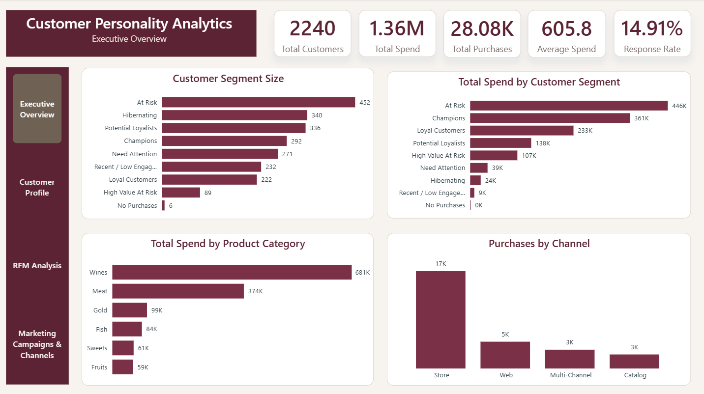
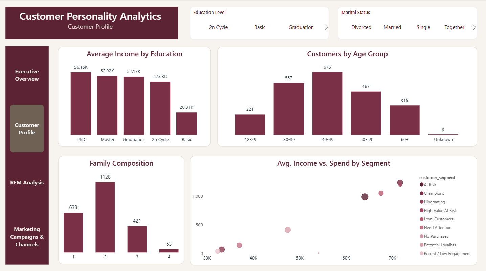
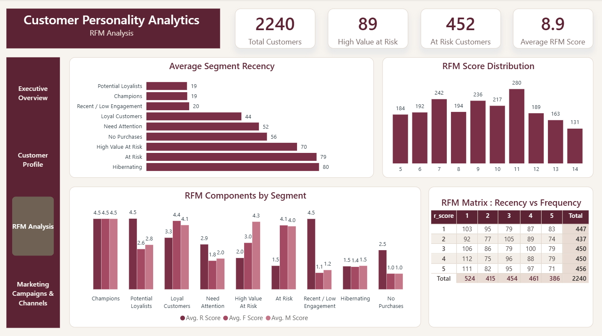
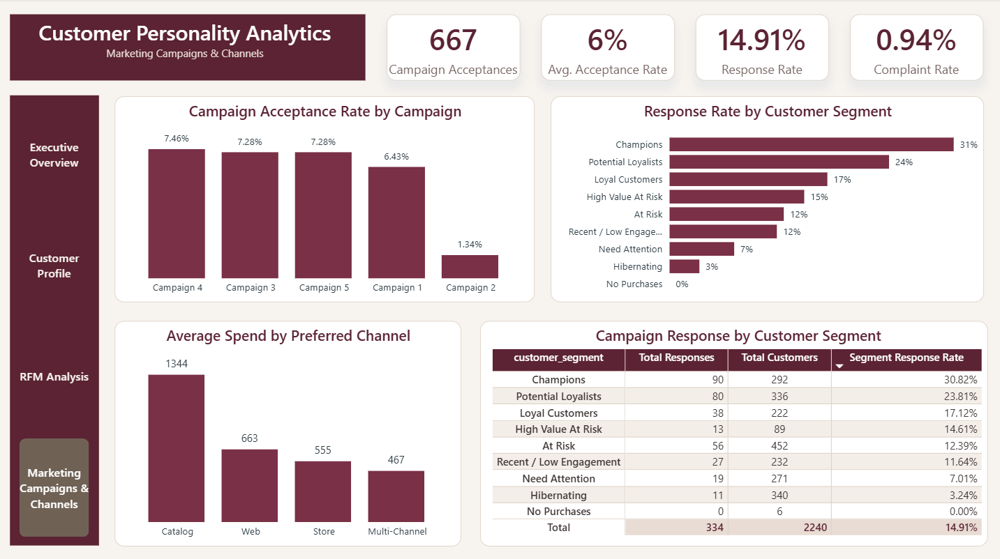

# Customer Personality Analytics

<p align="center">
  An end-to-end customer analytics project focused on customer behavior, purchasing patterns, RFM segmentation, and marketing campaign performance.
</p>

<p align="center">
  
  
  
  
  
  
</p>

---

## 📌 Project Overview

This project transforms raw customer and marketing data into an end-to-end analytical solution using **Excel, PostgreSQL, SQL, Power Query, Power BI, and DAX**.

The analysis focuses on understanding:

- Customer demographics and household characteristics.
- Purchasing behavior and spending patterns.
- Preferred purchasing channels.
- Customer value using RFM analysis.
- Customer segmentation.
- Marketing campaign acceptance and response.
- Customer complaints and engagement.
- High-value and at-risk customer groups.

The final outcome is an interactive **Power BI dashboard** designed to turn customer-level data into clear business insights.

---

## 🎯 Business Objectives

The project aims to answer key business questions such as:

- Who are the customers and what are their main characteristics?
- How do customers spend across different product categories?
- Which purchasing channels are most frequently used?
- Which customers are highly valuable?
- Which customers are at risk of disengagement?
- How do different customer segments respond to marketing campaigns?
- Which campaigns have stronger acceptance rates?
- How can customer behavior support more targeted marketing strategies?

---

## 📊 Dataset

The dataset contains **2,240 customer records** with information covering:

- Customer demographics.
- Education and marital status.
- Income.
- Household composition.
- Product spending.
- Purchasing channels.
- Website activity.
- Marketing campaign acceptance.
- Campaign response.
- Customer complaints.
- Customer registration date.

The dataset was initially inspected in Excel and then processed through PostgreSQL and SQL before being prepared for Power BI reporting.

### Data Quality Note

During the cleaning process, invalid birth-year values were identified and converted to missing values rather than being artificially imputed.

As a result, **3 customers have missing Age values** in the final analytical dataset.

---

## 🛠️ Tools & Technologies

| Tool | Purpose |
|---|---|
| **Excel** | Initial data inspection and understanding of the raw dataset |
| **PostgreSQL** | Data storage, profiling, cleaning, validation, feature engineering, RFM scoring, and segmentation |
| **SQL** | Data quality analysis, transformation logic, validation, feature engineering, and analytical dataset preparation |
| **Power Query** | Additional data preparation and transformation inside Power BI |
| **Power BI** | Data modeling, visualization, dashboard development, and interactive analysis |
| **DAX** | KPIs, analytical measures, campaign metrics, and RFM-related calculations |

---

## 🔄 Project Workflow

The project follows an end-to-end analytics workflow:

**Excel → PostgreSQL / SQL → Power Query → Power BI / DAX → Business Insights**

### Workflow Breakdown

**1. Excel — Initial Data Inspection**

The raw dataset was reviewed to understand its structure and identify potential data quality issues before the main preparation stage.

**2. PostgreSQL / SQL — Data Preparation & Analytics**

The data was imported into PostgreSQL and processed through:

- Data Quality Profiling.
- Data Cleaning.
- Data Validation.
- Feature Engineering.
- RFM Scoring.
- Customer Segmentation.
- Final Dataset Preparation.

**3. Power Query — Data Preparation**

Power Query was used within Power BI for additional data preparation and transformation before the final reporting layer.

**4. Power BI / DAX — Reporting & Analysis**

The prepared dataset was modeled in Power BI and used to build:

- Interactive KPIs.
- Customer analysis.
- RFM analysis.
- Campaign analysis.
- Business-focused visualizations.

**5. Business Insights**

The final dashboard was used to translate the analytical results into customer and marketing insights.

---

## 🔍 Data Quality & Preparation

Data quality was treated as a dedicated stage of the project rather than simply cleaning the data before analysis.

The objective was to understand the condition of the raw data, identify potential issues, apply controlled transformations, and validate the results before using the data for reporting.

---

## 1. Data Quality Profiling

The raw data was imported into PostgreSQL and profiled before cleaning.

The profiling process included:

- Row count validation.
- Column and data type inspection.
- Sample record review.
- Duplicate customer ID checks.
- Missing-value analysis.
- Column fill-rate analysis.
- Categorical value distributions.
- Numerical statistics.
- Campaign acceptance distributions.
- Campaign response distribution.
- Complaint distribution.
- Suspicious income-value detection.
- Invalid birth-year detection.
- Unusual marital-status detection.
- Date validity checks.

This stage helped identify data quality issues before applying transformations.

---

## 2. Data Cleaning

A dedicated cleaned dataset was created with appropriate data types and standardized values.

### Key Cleaning Steps

- Converted text-based numeric fields into appropriate numeric data types.
- Converted customer registration dates into proper `DATE` values.
- Treated blank income values as missing.
- Treated the suspicious income value `666666` as missing.
- Converted invalid birth-year values below the defined validity threshold into `NULL`.
- Standardized marital-status values:
  - `Alone` → `Single`
  - `Absurd` → `Unknown`
  - `YOLO` → `Unknown`

The cleaned dataset was then validated to ensure that the intended transformations were correctly applied.

---

## 3. Data Validation

Validation was performed after the cleaning stage to confirm data consistency.

Validation checks included:

- Customer record count.
- Customer ID uniqueness.
- Missing-value checks.
- Invalid income-value checks.
- Marital-status distribution.
- Date-type validation.
- Feature calculation checks.
- Negative-value checks where applicable.
- No-purchase customer validation.
- Preferred-channel validation.
- RFM and segmentation validation.

This approach helped ensure that the final analytical dataset was reliable enough for downstream reporting.

---

## 🧮 Feature Engineering

Several analytical features were created to support customer behavior analysis.

| Feature | Description |
|---|---|
| `age` | Customer age derived from year of birth |
| `family_size` | Household size based on children and teenagers |
| `total_spend` | Total spending across product categories |
| `total_purchases` | Total purchases across Web, Catalog, and Store |
| `total_campaigns_accepted` | Total accepted marketing campaigns |
| `customer_tenure_days` | Customer tenure based on registration date |
| `preferred_channel` | Main purchasing channel based on customer behavior |

### Preferred Channel Logic

Customer purchasing behavior was further classified into:

- **Web**
- **Catalog**
- **Store**
- **Multi-Channel**
- **No Purchases**

Customers with no recorded purchases were explicitly classified as `No Purchases`.

When purchase counts were tied across channels, the customer was classified as `Multi-Channel`.

---

## 🗄️ SQL & PostgreSQL Pipeline

The PostgreSQL stage represents the main SQL-based preparation and analytical processing layer of the project.

The SQL workflow includes:

```text
Raw Data
   ↓
Raw Table
   ↓
Data Quality Profiling
   ↓
Data Cleaning
   ↓
Validation
   ↓
Feature Engineering
   ↓
RFM Scoring
   ↓
Customer Segmentation
   ↓
Final Analytical Dataset
   ↓
Final Validation
```

---

## 📁 SQL Project File

The complete PostgreSQL work is documented in:

`sql/customer_personality_pipeline.sql`

This file contains the SQL logic used throughout the PostgreSQL stage, including:

- Raw table creation.
- Data profiling queries.
- Data cleaning logic.
- Validation queries.
- Feature engineering.
- RFM scoring.
- Customer segmentation.
- Final analytical view preparation.
- Final data quality checks.

The SQL file acts as a **reproducibility and documentation layer** for the project.

It demonstrates how the raw customer data was assessed, cleaned, transformed, validated, and prepared before being consumed by the Power BI reporting layer.

> The SQL file is intentionally focused on the actual PostgreSQL work performed in the project. Separate business-analysis SQL queries were not created simply for documentation purposes.

---

## 🧩 Why SQL and Power Query Both Appear in the Workflow

The two tools serve different roles in the project.

### PostgreSQL / SQL

Used for the main database-side processing:

- Profiling.
- Cleaning.
- Validation.
- Feature engineering.
- RFM scoring.
- Segmentation.
- Final analytical dataset preparation.

### Power Query

Used inside Power BI for additional data preparation and transformation before modeling and visualization.

This creates a clear separation between the **database/analytical preparation layer** and the **Power BI reporting preparation layer**.

---

## 📈 RFM Analysis

RFM analysis was used to evaluate customer value and engagement through three behavioral dimensions:

### Recency

Measures how recently a customer made a purchase.

### Frequency

Measures how frequently a customer purchases.

### Monetary

Measures how much a customer spends.

Each component was assigned a score from **1 to 5**.

The overall RFM score was calculated as:

`RFM Score = R Score + F Score + M Score`

The resulting RFM scores were then used as part of the customer segmentation logic.

---

## 👥 Customer Segmentation

Customers were classified into business-oriented segments using RFM scores and purchasing behavior.

| Segment | Business Definition |
|---|---|
| **Champions** | Recent, frequent, and high-spending customers |
| **Loyal Customers** | Customers with strong purchasing frequency and value |
| **Potential Loyalists** | Recent customers with potential for stronger engagement |
| **High Value At Risk** | High-spending customers showing reduced recent engagement |
| **At Risk** | Customers with weaker recency but meaningful purchasing history |
| **Hibernating** | Customers with low recent activity and lower overall value |
| **Recent / Low Engagement** | Recent customers with limited frequency and monetary value |
| **Need Attention** | Customers outside the main segment definitions |
| **No Purchases** | Customers with no recorded purchases |

The segmentation logic was implemented in SQL and validated before the final analytical dataset was used in Power BI.

---

## 🔄 Power Query

Power Query was used within Power BI as an additional data preparation and transformation layer.

It was applied after the PostgreSQL / SQL preparation stage and before the final Power BI reporting layer.

This helped prepare the dataset for:

- Power BI data modeling.
- Interactive filtering.
- Visualization.
- Dashboard analysis.

---

# 📊 Dashboard Preview

The final Power BI solution contains **four analytical pages**, each designed around a specific business question.

---

## 1. Executive Overview



### Business Question

**What is happening across the overall customer base?**

This page provides a high-level view of customer size, spending, purchasing activity, and customer segments.

### KPIs

- Total Customers
- Total Spend
- Total Purchases
- Average Spend
- Response Rate

### Visualizations

- Customer Segment Size
- Revenue by Customer Segment
- Total Spend by Product Category
- Purchases by Channel

This page provides the starting point for understanding the overall business picture.

---

## 2. Customer Profile



### Business Question

**Who are the customers?**

This page explores customer demographics, household characteristics, income, age, and spending behavior.

### Visualizations

- Average Income by Education
- Customers by Age Group
- Family Composition
- Income vs. Spending by Customer Segment

### Filters

- Education Level
- Marital Status

The page helps connect customer characteristics with purchasing behavior.

---

## 3. RFM Analysis



### Business Question

**Who is valuable, and who may be at risk?**

This page focuses on customer value, engagement, and RFM-based segmentation.

### KPIs

- Total Customers
- High Value At Risk
- At Risk Customers
- Average RFM Score

### Visualizations

- Average Segment Recency
- RFM Score Distribution
- RFM Components by Segment
- RFM Matrix

The page provides a deeper view of customer value through Recency, Frequency, and Monetary behavior.

---

## 4. Marketing Campaigns & Channels



### Business Question

**How are customers responding to marketing campaigns?**

This page evaluates campaign acceptance, customer response, spending behavior, and engagement across customer segments.

### KPIs

- Campaign Acceptances
- Avg. Acceptance Rate
- Response Rate
- Complaint Rate

### Visualizations

- Campaign Acceptance Rate
- Response Rate by Customer Segment
- Average Spend by Preferred Channel
- Campaign Response by Customer Segment

### Campaign Response Matrix

The matrix includes:

- Total Responses
- Total Customers
- Segment Response Rate

This makes it possible to compare campaign engagement across different customer segments.

---

## 📄 Project Report

A PDF version of the complete Power BI dashboard is available here:

[View the Full Dashboard Report](Customer_Personality_Analytics.pdf)

---

## 🧠 DAX & KPI Development

DAX was used to create dynamic measures for the dashboard.

Examples include:

```DAX
Total Customers =
DISTINCTCOUNT(customer_personality_final[id])
```

```DAX
Total Purchases =
SUM(customer_personality_final[total_purchases])
```

```DAX
Total Campaign Acceptances =
SUM(customer_personality_final[total_campaigns_accepted])
```

```DAX
Complaint Rate =
DIVIDE(
    CALCULATE(
        DISTINCTCOUNT(customer_personality_final[ID]),
        customer_personality_final[complain] = 1
    ),
    [Total Customers],
    0
)
```

Additional DAX measures were created for:

- Average Spend.
- Response Rate.
- Campaign Acceptance Rate.
- Average RFM Score.
- Average R Score.
- Average F Score.
- Average M Score.
- Segment-level customer metrics.

---

## 🎨 Dashboard Design

The dashboard was designed around a consistent analytical flow:

**Overview → Customer Profile → RFM Analysis → Marketing & Campaigns**

This structure allows the user to move from:

**What is happening?**

to:

**Who are the customers?**

then:

**Who is valuable or at risk?**

and finally:

**How are customers responding to marketing?**

---

## 💡 Key Insights

The final dashboard highlights several important patterns in customer behavior and marketing engagement.

### Customer Value & Risk

- The **At Risk** segment contains **452 customers**, making customer re-engagement an important area for analysis.
- The **High Value At Risk** segment contains **89 customers**, representing customers with relatively high monetary value but weaker recent engagement.
- **Champions** show strong customer value characteristics and a response rate of approximately **31%** in the dashboard analysis.
- The **No Purchases** segment contains customers with no recorded purchases and should be treated separately from active purchasing segments.

### Product Spending

- **Wine** is the largest spending category in the dataset, with total customer spending of approximately **681K**.
- Product-level spending analysis provides an opportunity to understand which categories contribute most to overall customer value.

### Customer Segments & Spending

- The **At Risk** segment represents approximately **446K** in total customer spending, highlighting the monetary value associated with customers showing reduced recent engagement.
- RFM segmentation therefore provides a useful way to move beyond customer counts and examine the financial value associated with different behavioral groups.

### Marketing Campaigns

- Campaign acceptance varies considerably across campaigns.
- Campaign 2 has an acceptance rate of approximately **1.34%**.
- Campaign 4 has an acceptance rate of approximately **7.46%**.
- Campaign response also varies across customer segments, making segment-level campaign analysis useful for more targeted marketing strategies.

> The figures above represent results from the final project dashboard and are intended as portfolio-level analytical findings.

---

# 🎯 Business Recommendations

Based on the analytical findings, several business actions can be considered.

## 1. Re-engage At-Risk Customers

Develop targeted re-engagement strategies for customers showing reduced recent activity.

Potential approaches include:

- Personalized offers.
- Product recommendations.
- Limited-time promotions.
- Re-engagement campaigns.

---

## 2. Protect High-Value Customers

High Value At Risk customers combine relatively high spending with weaker recent engagement.

Potential strategies include:

- Personalized communication.
- Loyalty incentives.
- Exclusive offers.
- Targeted retention campaigns.

---

## 3. Strengthen Customer Loyalty

Champions and Loyal Customers can be supported through loyalty-focused initiatives designed to maintain engagement and encourage repeat purchases.

---

## 4. Improve Campaign Targeting

Campaign performance should be evaluated by customer segment rather than relying only on overall campaign metrics.

This can help identify which customer groups are more responsive to different campaign strategies.

---

## 5. Leverage Purchasing Channels

Customer purchasing behavior across Web, Catalog, Store, and Multi-Channel groups can be used to support more personalized communication and promotional strategies.

---

# 📁 Repository Structure

The recommended GitHub repository structure is:

```text
Customer-Personality-Analytics/
│
├── README.md
│
├── sql/
│   └── customer_personality_pipeline.sql
│
├── Assets/
│   ├── 1_Executive_Overview.png
│   ├── 2_Customer_Profile.png
│   ├── 3_RFM_Analysis.png
│   └── 4_Marketing_Campaigns_and_Channels.png
│
└── Customer_Personality_Analytics.pdf
```

### Repository Components

**`README.md`**

Project documentation, methodology, dashboard overview, and key findings.

**`sql/customer_personality_pipeline.sql`**

The PostgreSQL / SQL pipeline covering data profiling, cleaning, validation, feature engineering, RFM scoring, customer segmentation, and final data preparation.

**`Assets/`**

Contains the four Power BI dashboard page screenshots used to showcase the final analytical solution.

**`Customer_Personality_Analytics.pdf`**

A PDF version of the complete Power BI dashboard for convenient viewing of the final report.

---

# 🧰 Skills Demonstrated

This project demonstrates practical experience in:

### Data Analytics

- Exploratory Data Analysis
- Data Quality Profiling
- Data Cleaning
- Data Validation
- Feature Engineering

### SQL & Database

- PostgreSQL
- SQL
- Data Transformation
- Analytical Views
- Validation Queries
- RFM Scoring
- Customer Segmentation

### Business Intelligence

- Power Query
- Power BI
- Data Modeling
- DAX
- KPI Development
- Interactive Dashboard Design

### Business Analysis

- Customer Segmentation
- Customer Value Analysis
- RFM Analysis
- Marketing Campaign Analysis
- Customer Engagement Analysis
- Business Insight Generation
- Data Storytelling

---

# 🚀 Future Improvements

Potential future enhancements include:

- Customer Lifetime Value analysis.
- Customer churn prediction.
- Campaign response prediction.
- Cohort analysis.
- Customer-level drill-through analysis.
- Automated data refresh.
- Advanced predictive customer analytics.

---

# 📌 Project Outcome

This project demonstrates a complete customer analytics workflow from raw data inspection to business intelligence reporting.

The solution combines:

**Excel → PostgreSQL / SQL → Power Query → Power BI → DAX → Business Insights**

The final dashboard brings together:

- Customer profiles.
- Purchasing behavior.
- Product spending.
- Channel preferences.
- RFM analysis.
- Customer segmentation.
- Campaign acceptance.
- Campaign response.
- Customer complaints.

The result is a structured and interactive customer analytics solution that demonstrates both **technical data skills** and the ability to translate analytical results into **business-oriented insights**.

---

# 👩‍💻 Author

**Customer Personality Analytics**

Built as a portfolio project demonstrating practical skills in:

**SQL | PostgreSQL | Power Query | Power BI | DAX | Customer Analytics | RFM Segmentation**

---

